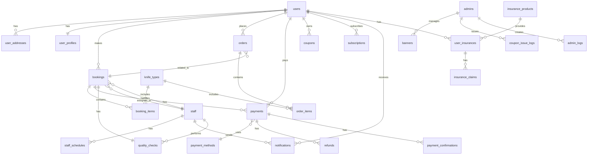

# 칼가는곳 데이터베이스 스키마 문서

> Supabase MVP 프로젝트 데이터베이스 구조 상세 문서
> 
> - **프로젝트 ID**: hrsqcroirtzbdoeheyxy
> - **지역**: ap-northeast-2 (서울)
> - **최종 업데이트**: 2025-10-01

## 📋 목차

1. [데이터베이스 개요](#데이터베이스-개요)
2. [테이블 구조](#테이블-구조)
3. [테이블 간 관계 (ERD)](#테이블-간-관계-erd)
4. [RLS 정책](#rls-정책)
5. [인덱스 전략](#인덱스-전략)
6. [초기 데이터](#초기-데이터)

---

## 데이터베이스 개요

칼가는곳 서비스는 총 **34개의 테이블**과 **1개의 뷰(View)**로 구성되어 있으며, 다음과 같은 주요 도메인으로 분류됩니다:

### 도메인별 분류
- **👤 사용자 관리**: users, user_profiles, user_addresses, verification_codes
- **🔪 상품/서비스**: knife_types, products (뷰)
- **📅 예약/주문**: bookings, booking_items, orders, order_items
- **💳 결제**: payments, payment_methods, payment_bank_accounts, payment_confirmations, refunds
- **🎫 쿠폰/구독**: coupons, coupon_templates, coupon_issue_logs, subscriptions
- **🔔 알림**: notifications, notification_settings, announcements
- **👔 직원/관리**: staff, staff_schedules, admins, admin_logs, admin_settings
- **🛡️ 보험/품질**: insurance_products, user_insurances, insurance_claims, quality_checks
- **🏢 운영**: customer_support, home_banners, banners, terms, bank_accounts, service_records, member_grade_history

---

## 테이블 구조

### 1. 👤 사용자 관리

#### `users` (사용자)
| 컬럼명 | 타입 | 제약조건 | 설명 |
|--------|------|----------|------|
| id | UUID | PK | 사용자 고유 ID |
| phone | VARCHAR | UNIQUE, NOT NULL | 전화번호 |
| name | VARCHAR | NOT NULL | 이름 |
| status | VARCHAR | DEFAULT 'active' | 상태 (active/inactive/suspended) |
| last_login_at | TIMESTAMPTZ | | 마지막 로그인 시간 |
| login_count | INTEGER | DEFAULT 0 | 로그인 횟수 |
| blocked_at | TIMESTAMPTZ | | 차단 시간 |
| blocked_reason | TEXT | | 차단 사유 |
| created_at | TIMESTAMPTZ | DEFAULT now() | 생성일 |
| updated_at | TIMESTAMPTZ | DEFAULT now() | 수정일 |

#### `user_profiles` (사용자 프로필)
| 컬럼명 | 타입 | 제약조건 | 설명 |
|--------|------|----------|------|
| id | UUID | PK, FK → users.id | 사용자 ID |
| coupon_count | INTEGER | DEFAULT 0 | 보유 쿠폰 수 |
| subscription_status | VARCHAR | DEFAULT 'none' | 구독 상태 (none/active/expired) |
| notification_enabled | BOOLEAN | DEFAULT true | 알림 활성화 |
| total_services | INTEGER | DEFAULT 0 | 총 서비스 이용 횟수 |
| member_grade | VARCHAR | DEFAULT 'bronze' | 회원 등급 (bronze/silver/gold/platinum) |
| created_at | TIMESTAMPTZ | | 생성일 |
| updated_at | TIMESTAMPTZ | | 수정일 |

#### `user_addresses` (사용자 주소)
| 컬럼명 | 타입 | 제약조건 | 설명 |
|--------|------|----------|------|
| id | UUID | PK | 주소 ID |
| user_id | UUID | FK → users.id | 사용자 ID |
| address_type | VARCHAR | DEFAULT 'home' | 주소 유형 (home/work/other) |
| address_name | VARCHAR | | 주소 별칭 |
| postal_code | VARCHAR | | 우편번호 |
| address | VARCHAR | NOT NULL | 주소 |
| detail_address | VARCHAR | | 상세주소 |
| latitude | NUMERIC | | 위도 |
| longitude | NUMERIC | | 경도 |
| is_default | BOOLEAN | DEFAULT false | 기본 주소 여부 |

#### `verification_codes` (인증 코드)
| 컬럼명 | 타입 | 제약조건 | 설명 |
|--------|------|----------|------|
| id | UUID | PK | 인증 코드 ID |
| phone | VARCHAR | NOT NULL | 전화번호 |
| code | VARCHAR | NOT NULL | 인증 코드 |
| type | VARCHAR | DEFAULT 'phone_verification' | 인증 유형 |
| expires_at | TIMESTAMPTZ | NOT NULL | 만료 시간 |
| used | BOOLEAN | DEFAULT false | 사용 여부 |

### 2. 🔪 상품/서비스

#### `knife_types` (칼 종류)
| 컬럼명 | 타입 | 제약조건 | 설명 |
|--------|------|----------|------|
| id | UUID | PK | 칼 종류 ID |
| name | VARCHAR | NOT NULL | 이름 |
| description | TEXT | | 설명 |
| image_url | VARCHAR | | 이미지 URL |
| market_price | INTEGER | NOT NULL | 시장가 |
| discount_price | INTEGER | NOT NULL | 할인가 |
| care_instructions | TEXT | | 관리 방법 |
| additional_notes | TEXT | | 추가 설명 |
| is_active | BOOLEAN | DEFAULT true | 활성화 여부 |
| display_order | INTEGER | DEFAULT 0 | 표시 순서 |

**현재 데이터 (10개)**:
- 소형 칼: 4,000원 → 3,000원
- 일반 칼: 6,500원 → 6,000원
- 대형 칼: 10,000원 → 8,000원
- 중식도: 10,000원 → 8,000원
- 회칼: 20,000원 → 13,000원
- 정육칼: 13,000원 → 10,000원
- 특수칼: 20,000원 → 10,000원
- 일반 가위: 4,000원 → 3,000원
- 특수 가위: 50,000원 → 30,000원
- 농기구: 5,000원 → 3,000원

#### `products` (상품 - VIEW)
> knife_types 테이블을 기반으로 한 뷰로, 관리자 API 호환성을 위해 생성
- knife_types의 모든 컬럼 포함
- category 컬럼 자동 매핑 (knife/scissors/tool)

### 3. 📅 예약/주문

#### `bookings` (예약)
| 컬럼명 | 타입 | 제약조건 | 설명 |
|--------|------|----------|------|
| id | UUID | PK | 예약 ID |
| user_id | UUID | FK → users.id | 사용자 ID |
| booking_date | DATE | NOT NULL | 예약 날짜 |
| booking_time | TIME | NOT NULL | 예약 시간 |
| status | VARCHAR | DEFAULT 'pending' | 상태 (pending/confirmed/in_progress/completed/cancelled) |
| total_quantity | INTEGER | DEFAULT 0 | 총 수량 |
| total_amount | INTEGER | DEFAULT 0 | 총 금액 |
| special_instructions | TEXT | | 특별 요청사항 |
| is_pickup_service | BOOLEAN | DEFAULT false | 픽업 서비스 여부 |
| pickup_address | TEXT | | 픽업 주소 |
| pickup_fee | INTEGER | DEFAULT 0 | 픽업 수수료 |
| assigned_staff | UUID | FK → staff.id | 담당 직원 |
| completed_by | UUID | FK → staff.id | 완료 처리 직원 |
| quality_rating | INTEGER | CHECK (1-5) | 품질 평점 |

#### `booking_items` (예약 항목)
| 컬럼명 | 타입 | 제약조건 | 설명 |
|--------|------|----------|------|
| id | UUID | PK | 항목 ID |
| booking_id | UUID | FK → bookings.id | 예약 ID |
| knife_type_id | UUID | FK → knife_types.id | 칼 종류 ID |
| quantity | INTEGER | DEFAULT 1 | 수량 |
| unit_price | INTEGER | NOT NULL | 단가 |
| total_price | INTEGER | NOT NULL | 총 가격 |

#### `orders` (주문)
| 컬럼명 | 타입 | 제약조건 | 설명 |
|--------|------|----------|------|
| id | UUID | PK | 주문 ID |
| order_number | VARCHAR | UNIQUE, NOT NULL | 주문 번호 |
| user_id | UUID | FK → users.id | 사용자 ID |
| booking_id | UUID | FK → bookings.id | 연결된 예약 ID |
| customer_phone | VARCHAR | NOT NULL | 고객 전화번호 |
| customer_name | VARCHAR | NOT NULL | 고객명 |
| total_amount | INTEGER | NOT NULL | 총 금액 |
| discount_amount | INTEGER | DEFAULT 0 | 할인 금액 |
| final_amount | INTEGER | NOT NULL | 최종 금액 |
| status | VARCHAR | DEFAULT 'pending' | 상태 (pending/confirmed/completed/cancelled) |
| service_date | TIMESTAMPTZ | | 서비스 날짜 |
| service_address | TEXT | | 서비스 주소 |
| cash_receipt_requested | BOOLEAN | DEFAULT false | 현금영수증 요청 |

#### `order_items` (주문 항목)
| 컬럼명 | 타입 | 제약조건 | 설명 |
|--------|------|----------|------|
| id | UUID | PK | 항목 ID |
| order_id | UUID | FK → orders.id | 주문 ID |
| knife_type_id | UUID | FK → knife_types.id | 칼 종류 ID |
| product_name | VARCHAR | NOT NULL | 상품명 |
| quantity | INTEGER | DEFAULT 1 | 수량 |
| unit_price | INTEGER | NOT NULL | 단가 |
| total_price | INTEGER | NOT NULL | 총 가격 |

### 4. 💳 결제

#### `payments` (결제)
| 컬럼명 | 타입 | 제약조건 | 설명 |
|--------|------|----------|------|
| id | UUID | PK | 결제 ID |
| booking_id | UUID | FK → bookings.id | 예약 ID |
| user_id | UUID | FK → users.id | 사용자 ID |
| payment_method_id | UUID | FK → payment_methods.id | 결제 방법 ID |
| order_id | VARCHAR | UNIQUE | 주문 ID |
| amount | INTEGER | NOT NULL | 금액 |
| discount_amount | INTEGER | DEFAULT 0 | 할인 금액 |
| insurance_amount | INTEGER | DEFAULT 0 | 보험료 |
| final_amount | INTEGER | NOT NULL | 최종 금액 |
| status | VARCHAR | DEFAULT 'pending' | 상태 (pending/paid/failed/cancelled/refunded) |
| payment_method | VARCHAR | DEFAULT 'bank_transfer' | 결제 방법 |
| depositor_name | VARCHAR | | 입금자명 |
| deposit_deadline | TIMESTAMPTZ | | 입금 기한 |
| verified_by | UUID | FK → staff.id | 확인 직원 |

#### `payment_methods` (결제 방법)
| 컬럼명 | 타입 | 제약조건 | 설명 |
|--------|------|----------|------|
| id | UUID | PK | 결제 방법 ID |
| name | VARCHAR | NOT NULL | 이름 |
| type | VARCHAR | NOT NULL | 유형 (card/bank_transfer/mobile/simple_pay) |
| provider | VARCHAR | | 제공자 |
| icon_url | TEXT | | 아이콘 URL |
| is_active | BOOLEAN | DEFAULT true | 활성화 여부 |

#### `refunds` (환불)
| 컬럼명 | 타입 | 제약조건 | 설명 |
|--------|------|----------|------|
| id | UUID | PK | 환불 ID |
| payment_id | UUID | FK → payments.id | 결제 ID |
| amount | INTEGER | NOT NULL | 환불 금액 |
| reason | TEXT | NOT NULL | 환불 사유 |
| status | VARCHAR | DEFAULT 'pending' | 상태 (pending/completed/failed) |
| requested_by | UUID | FK → users.id | 요청자 |

### 5. 🎫 쿠폰/구독

#### `coupons` (쿠폰)
| 컬럼명 | 타입 | 제약조건 | 설명 |
|--------|------|----------|------|
| id | UUID | PK | 쿠폰 ID |
| user_id | UUID | FK → users.id | 사용자 ID |
| coupon_type | VARCHAR | NOT NULL | 쿠폰 유형 (discount/free_service/cashback) |
| title | VARCHAR | NOT NULL | 제목 |
| description | TEXT | | 설명 |
| discount_amount | INTEGER | | 할인 금액 |
| discount_percent | INTEGER | | 할인율 (%) |
| min_order_amount | INTEGER | DEFAULT 0 | 최소 주문 금액 |
| max_discount_amount | INTEGER | | 최대 할인 금액 |
| status | VARCHAR | DEFAULT 'active' | 상태 (active/used/expired) |
| expires_at | TIMESTAMPTZ | | 만료일 |

#### `coupon_templates` (쿠폰 템플릿)
| 컬럼명 | 타입 | 제약조건 | 설명 |
|--------|------|----------|------|
| id | UUID | PK | 템플릿 ID |
| name | VARCHAR | NOT NULL | 이름 |
| coupon_type | VARCHAR | | 쿠폰 유형 |
| discount_percent | INTEGER | | 할인율 |
| valid_days | INTEGER | DEFAULT 30 | 유효 기간 (일) |
| is_active | BOOLEAN | DEFAULT true | 활성화 여부 |

**현재 템플릿 (5개)**:
- 특별 10% 할인 쿠폰
- 특별 20% 할인 쿠폰
- 반값 할인 쿠폰 (50%)
- 우리가 손해 보면서 까지 주는 쿠폰 (80%)
- 진짜 특별해서 주는 쿠폰 (100% 무료)

#### `coupon_issue_logs` (쿠폰 발급 로그)
| 컬럼명 | 타입 | 제약조건 | 설명 |
|--------|------|----------|------|
| id | UUID | PK | 로그 ID |
| coupon_id | UUID | FK → coupons.id | 쿠폰 ID |
| user_id | UUID | FK → users.id | 사용자 ID |
| admin_id | UUID | FK → admins.id | 발급 관리자 ID |
| issue_reason | TEXT | | 발급 사유 |
| issued_at | TIMESTAMPTZ | DEFAULT now() | 발급 시간 |

#### `subscriptions` (구독)
| 컬럼명 | 타입 | 제약조건 | 설명 |
|--------|------|----------|------|
| id | UUID | PK | 구독 ID |
| user_id | UUID | FK → users.id | 사용자 ID |
| plan_type | VARCHAR | DEFAULT 'monthly' | 플랜 유형 (monthly/yearly) |
| status | VARCHAR | DEFAULT 'active' | 상태 (active/cancelled/expired/pending) |
| start_date | TIMESTAMPTZ | | 시작일 |
| end_date | TIMESTAMPTZ | | 종료일 |
| auto_renewal | BOOLEAN | DEFAULT true | 자동 갱신 여부 |

### 6. 🔔 알림

#### `notifications` (알림)
| 컬럼명 | 타입 | 제약조건 | 설명 |
|--------|------|----------|------|
| id | UUID | PK | 알림 ID |
| user_id | UUID | FK → users.id | 사용자 ID |
| title | VARCHAR | NOT NULL | 제목 |
| message | TEXT | NOT NULL | 내용 |
| type | VARCHAR | DEFAULT 'general' | 유형 (booking/delivery/promotion/general) |
| is_read | BOOLEAN | DEFAULT false | 읽음 여부 |
| related_booking_id | UUID | FK → bookings.id | 관련 예약 ID |
| sent_by_admin | UUID | FK → staff.id | 발송 관리자 |
| admin_priority | VARCHAR | DEFAULT 'medium' | 우선순위 (high/medium/low) |
| delivery_status | VARCHAR | DEFAULT 'pending' | 전송 상태 (pending/sent/delivered/failed) |

#### `notification_settings` (알림 설정)
| 컬럼명 | 타입 | 제약조건 | 설명 |
|--------|------|----------|------|
| id | UUID | PK | 설정 ID |
| user_id | UUID | FK → users.id, UNIQUE | 사용자 ID |
| push_enabled | BOOLEAN | DEFAULT true | 푸시 알림 |
| sms_enabled | BOOLEAN | DEFAULT true | SMS 알림 |
| email_enabled | BOOLEAN | DEFAULT false | 이메일 알림 |
| marketing_enabled | BOOLEAN | DEFAULT false | 마케팅 수신 |
| service_status_enabled | BOOLEAN | DEFAULT true | 서비스 상태 알림 |

#### `announcements` (공지사항)
| 컬럼명 | 타입 | 제약조건 | 설명 |
|--------|------|----------|------|
| id | UUID | PK | 공지 ID |
| title | VARCHAR | NOT NULL | 제목 |
| content | TEXT | NOT NULL | 내용 |
| is_important | BOOLEAN | DEFAULT false | 중요 공지 여부 |
| is_active | BOOLEAN | DEFAULT true | 활성화 여부 |

### 7. 👔 직원/관리

#### `staff` (직원)
| 컬럼명 | 타입 | 제약조건 | 설명 |
|--------|------|----------|------|
| id | UUID | PK | 직원 ID |
| name | VARCHAR | NOT NULL | 이름 |
| phone | VARCHAR | UNIQUE | 전화번호 |
| email | VARCHAR | | 이메일 |
| role | VARCHAR | NOT NULL | 역할 (technician/admin/manager/customer_service) |
| specialties | TEXT[] | | 전문 분야 |
| active_status | BOOLEAN | DEFAULT true | 활성 상태 |
| performance_rating | NUMERIC | DEFAULT 0.00 | 성과 평점 |
| max_daily_bookings | INTEGER | DEFAULT 8 | 일일 최대 예약 수 |

#### `staff_schedules` (직원 일정)
| 컬럼명 | 타입 | 제약조건 | 설명 |
|--------|------|----------|------|
| id | UUID | PK | 일정 ID |
| staff_id | UUID | FK → staff.id | 직원 ID |
| work_date | DATE | NOT NULL | 근무일 |
| shift_start | TIME | NOT NULL | 근무 시작 시간 |
| shift_end | TIME | NOT NULL | 근무 종료 시간 |
| is_available | BOOLEAN | DEFAULT true | 가능 여부 |
| assigned_bookings_count | INTEGER | DEFAULT 0 | 배정된 예약 수 |

#### `admins` (관리자)
| 컬럼명 | 타입 | 제약조건 | 설명 |
|--------|------|----------|------|
| id | UUID | PK | 관리자 ID |
| email | VARCHAR | UNIQUE, NOT NULL | 이메일 |
| phone | VARCHAR | UNIQUE | 전화번호 |
| name | VARCHAR | NOT NULL | 이름 |
| password_hash | TEXT | NOT NULL | 암호화된 비밀번호 |
| role | VARCHAR | DEFAULT 'admin' | 역할 (super_admin/admin/manager) |
| is_active | BOOLEAN | DEFAULT true | 활성화 여부 |
| last_login_at | TIMESTAMPTZ | | 마지막 로그인 시간 |

**기본 관리자 계정**:
- 이메일: admin@kalganun.com
- 전화번호: 01012345678
- 비밀번호: password123!
- 역할: super_admin

#### `admin_logs` (관리자 활동 로그)
| 컬럼명 | 타입 | 제약조건 | 설명 |
|--------|------|----------|------|
| id | UUID | PK | 로그 ID |
| admin_id | UUID | NOT NULL | 관리자 ID |
| action_type | VARCHAR | NOT NULL | 액션 유형 |
| target_table | VARCHAR | NOT NULL | 대상 테이블 |
| target_id | UUID | | 대상 ID |
| old_values | JSONB | | 이전 값 |
| new_values | JSONB | | 새 값 |
| ip_address | INET | | IP 주소 |

#### `admin_settings` (관리자 설정)
| 컬럼명 | 타입 | 제약조건 | 설명 |
|--------|------|----------|------|
| id | UUID | PK | 설정 ID |
| setting_key | VARCHAR | UNIQUE | 설정 키 |
| setting_value | JSONB | | 설정 값 |
| category | VARCHAR | DEFAULT 'general' | 카테고리 |
| updated_by | UUID | FK → staff.id | 수정자 |

### 8. 🛡️ 보험/품질

#### `insurance_products` (보험 상품)
| 컬럼명 | 타입 | 제약조건 | 설명 |
|--------|------|----------|------|
| id | UUID | PK | 보험 상품 ID |
| name | VARCHAR | NOT NULL | 상품명 |
| description | TEXT | NOT NULL | 설명 |
| coverage_amount | INTEGER | NOT NULL | 보장 금액 |
| premium_rate | NUMERIC | NOT NULL | 보험료율 |
| min_premium | INTEGER | NOT NULL | 최소 보험료 |
| max_premium | INTEGER | | 최대 보험료 |
| coverage_details | JSONB | | 보장 상세 |

#### `user_insurances` (사용자 보험)
| 컬럼명 | 타입 | 제약조건 | 설명 |
|--------|------|----------|------|
| id | UUID | PK | 보험 ID |
| user_id | UUID | FK → users.id | 사용자 ID |
| insurance_product_id | UUID | FK → insurance_products.id | 보험 상품 ID |
| booking_id | UUID | FK → bookings.id | 예약 ID |
| policy_number | VARCHAR | UNIQUE | 증권 번호 |
| premium_amount | INTEGER | NOT NULL | 보험료 |
| coverage_amount | INTEGER | NOT NULL | 보장 금액 |
| status | VARCHAR | DEFAULT 'active' | 상태 (active/expired/claimed) |

#### `insurance_claims` (보험 청구)
| 컬럼명 | 타입 | 제약조건 | 설명 |
|--------|------|----------|------|
| id | UUID | PK | 청구 ID |
| user_insurance_id | UUID | FK → user_insurances.id | 사용자 보험 ID |
| claim_amount | INTEGER | NOT NULL | 청구 금액 |
| damage_description | TEXT | NOT NULL | 손상 설명 |
| damage_photos | TEXT[] | | 손상 사진 |
| status | VARCHAR | DEFAULT 'submitted' | 상태 (submitted/reviewing/approved/denied/paid) |

#### `quality_checks` (품질 검사)
| 컬럼명 | 타입 | 제약조건 | 설명 |
|--------|------|----------|------|
| id | UUID | PK | 검사 ID |
| booking_id | UUID | FK → bookings.id | 예약 ID |
| checked_by | UUID | FK → staff.id | 검사자 |
| overall_rating | INTEGER | CHECK (1-5) | 전체 평점 |
| sharpness_rating | INTEGER | CHECK (1-5) | 날카로움 평점 |
| appearance_rating | INTEGER | CHECK (1-5) | 외관 평점 |
| customer_satisfaction | INTEGER | CHECK (1-5) | 고객 만족도 |
| issues_found | TEXT[] | | 발견된 문제 |

### 9. 🏢 운영

#### `customer_support` (고객 지원)
| 컬럼명 | 타입 | 제약조건 | 설명 |
|--------|------|----------|------|
| id | UUID | PK | 지원 ID |
| user_id | UUID | FK → users.id | 사용자 ID |
| inquiry_type | VARCHAR | NOT NULL | 문의 유형 (service_quality/payment/booking/general/complaint/refund) |
| subject | VARCHAR | NOT NULL | 제목 |
| description | TEXT | NOT NULL | 내용 |
| status | VARCHAR | DEFAULT 'open' | 상태 (open/in_progress/resolved/closed) |
| priority | VARCHAR | DEFAULT 'medium' | 우선순위 (high/medium/low) |
| assigned_staff | UUID | FK → staff.id | 담당 직원 |

#### `home_banners` (홈 배너)
| 컬럼명 | 타입 | 제약조건 | 설명 |
|--------|------|----------|------|
| id | UUID | PK | 배너 ID |
| title | VARCHAR | NOT NULL | 제목 |
| subtitle | TEXT | | 부제목 |
| image_url | TEXT | | 이미지 URL |
| position | VARCHAR | | 위치 (home_main 등) |
| background_color | VARCHAR | DEFAULT '#F97316' | 배경색 |
| text_color | VARCHAR | DEFAULT '#FFFFFF' | 텍스트색 |
| link_url | TEXT | | 링크 URL |
| display_order | INTEGER | DEFAULT 0 | 표시 순서 |
| is_active | BOOLEAN | DEFAULT true | 활성화 여부 |

#### `banners` (배너)
> 관리자 API용 배너 테이블
- home_banners와 유사한 구조
- position 필드로 위치 관리
- admin_id로 생성/수정자 추적

#### `bank_accounts` (은행 계좌)
| 컬럼명 | 타입 | 제약조건 | 설명 |
|--------|------|----------|------|
| id | UUID | PK | 계좌 ID |
| bank_name | VARCHAR | NOT NULL | 은행명 |
| account_number | VARCHAR | NOT NULL | 계좌번호 |
| account_holder | VARCHAR | NOT NULL | 예금주 |
| is_active | BOOLEAN | DEFAULT true | 활성화 여부 |

**기본 계좌**:
- 은행: 농협은행
- 계좌번호: 301-0123-4567-89
- 예금주: 칼가는곳

#### `terms` (약관)
| 컬럼명 | 타입 | 제약조건 | 설명 |
|--------|------|----------|------|
| id | UUID | PK | 약관 ID |
| type | VARCHAR | NOT NULL | 유형 |
| title | VARCHAR | NOT NULL | 제목 |
| content | TEXT | NOT NULL | 내용 |
| version | VARCHAR | DEFAULT '1.0.0' | 버전 |
| is_active | BOOLEAN | DEFAULT true | 활성화 여부 |

#### `service_records` (서비스 기록)
| 컬럼명 | 타입 | 제약조건 | 설명 |
|--------|------|----------|------|
| id | UUID | PK | 서비스 기록 ID |
| user_id | UUID | FK → users.id | 사용자 ID |
| service_type | VARCHAR | NOT NULL | 서비스 유형 (sharpening/repair/cleaning) |
| service_date | TIMESTAMPTZ | | 서비스 날짜 |
| knife_count | INTEGER | DEFAULT 1 | 칼 개수 |
| total_amount | INTEGER | NOT NULL | 총 금액 |
| status | VARCHAR | DEFAULT 'completed' | 상태 |
| rating | INTEGER | CHECK (1-5) | 평점 |
| review | TEXT | | 리뷰 |
| assigned_staff | UUID | FK → staff.id | 담당 직원 |

#### `member_grade_history` (회원 등급 이력)
| 컬럼명 | 타입 | 제약조건 | 설명 |
|--------|------|----------|------|
| id | UUID | PK | 이력 ID |
| user_id | UUID | FK → users.id | 사용자 ID |
| old_grade | VARCHAR | NOT NULL | 이전 등급 |
| new_grade | VARCHAR | NOT NULL | 새 등급 |
| reason | VARCHAR | NOT NULL | 변경 사유 |
| service_count | INTEGER | | 서비스 이용 횟수 |

---

## 테이블 간 관계 (ERD)

### 주요 관계도



### Foreign Key 관계 상세

#### 사용자 중심 관계
- `user_profiles.id` → `users.id` (1:1)
- `user_addresses.user_id` → `users.id` (1:N)
- `bookings.user_id` → `users.id` (1:N)
- `orders.user_id` → `users.id` (1:N)
- `payments.user_id` → `users.id` (1:N)
- `coupons.user_id` → `users.id` (1:N)
- `notifications.user_id` → `users.id` (1:N)

#### 예약/주문 관계
- `booking_items.booking_id` → `bookings.id` (N:1)
- `booking_items.knife_type_id` → `knife_types.id` (N:1)
- `order_items.order_id` → `orders.id` (N:1)
- `order_items.knife_type_id` → `knife_types.id` (N:1)
- `orders.booking_id` → `bookings.id` (1:1)

#### 결제 관계
- `payments.booking_id` → `bookings.id` (N:1)
- `payments.payment_method_id` → `payment_methods.id` (N:1)
- `refunds.payment_id` → `payments.id` (N:1)
- `payment_confirmations.payment_id` → `payments.id` (N:1)

#### 직원/관리 관계
- `bookings.assigned_staff` → `staff.id` (N:1)
- `bookings.completed_by` → `staff.id` (N:1)
- `staff_schedules.staff_id` → `staff.id` (N:1)
- `quality_checks.checked_by` → `staff.id` (N:1)
- `notifications.sent_by_admin` → `staff.id` (N:1)

#### 관리자 관계
- `banners.created_by` → `admins.id` (N:1)
- `banners.updated_by` → `admins.id` (N:1)
- `coupon_issue_logs.admin_id` → `admins.id` (N:1)

---

## RLS 정책

### Row Level Security 활성화 테이블
모든 주요 테이블에 RLS가 활성화되어 있으며, 다음과 같은 정책이 적용됩니다:

#### 1. 공개 읽기 정책
- `knife_types`: 모든 사용자 읽기 가능
- `products` (뷰): 모든 사용자 읽기 가능
- `banners`: 활성 배너는 모든 사용자 읽기 가능
- `bank_accounts`: 모든 사용자 읽기 가능
- `announcements`: 활성 공지는 모든 사용자 읽기 가능
- `terms`: 활성 약관은 모든 사용자 읽기 가능

#### 2. 사용자별 접근 정책
- `users`: 본인 정보만 읽기/수정 가능
- `user_profiles`: 본인 프로필만 접근 가능
- `user_addresses`: 본인 주소만 관리 가능
- `bookings`: 본인 예약만 조회 가능 (관리자는 전체 조회)
- `orders`: 본인 주문만 조회 가능 (관리자는 전체 조회)
- `payments`: 본인 결제만 조회 가능 (관리자는 전체 조회)
- `coupons`: 본인 쿠폰만 조회 가능
- `notifications`: 본인 알림만 조회 가능

#### 3. 관리자 전용 정책
- `admins`: 슈퍼관리자만 전체 관리, 본인 정보는 수정 가능
- `admin_logs`: 관리자만 접근 가능
- `admin_settings`: 관리자만 수정 가능
- `staff`: 관리자만 관리 가능
- `coupon_issue_logs`: 관리자만 접근 가능
- `customer_support`: 관리자는 전체, 사용자는 본인 문의만

#### 4. 상품/배너 관리 정책
- `knife_types`: 관리자만 추가/수정/삭제 가능
- `banners`: admin/super_admin 역할만 관리 가능
- `home_banners`: 관리자만 관리 가능
- `bank_accounts`: admin/super_admin만 수정 가능

#### 5. 결제 관련 정책
- `payment_bank_accounts`: RLS 비활성화 (시스템 관리)
- `payment_confirmations`: RLS 비활성화 (시스템 관리)

---

## 인덱스 전략

### 기본 인덱스 (Primary Keys)
모든 테이블의 id 컬럼에 자동 생성

### 추가 인덱스
```sql
-- 사용자 관련
CREATE INDEX idx_users_phone ON users(phone);
CREATE INDEX idx_users_status ON users(status);

-- 상품 관련
CREATE INDEX idx_knife_types_is_active ON knife_types(is_active);
CREATE INDEX idx_products_category ON products(category);
CREATE INDEX idx_products_is_active ON products(is_active);

-- 예약/주문 관련
CREATE INDEX idx_bookings_user_id ON bookings(user_id);
CREATE INDEX idx_bookings_status ON bookings(status);
CREATE INDEX idx_bookings_booking_date ON bookings(booking_date);
CREATE INDEX idx_orders_user_id ON orders(user_id);
CREATE INDEX idx_orders_status ON orders(status);
CREATE INDEX idx_order_items_order_id ON order_items(order_id);

-- 결제 관련
CREATE INDEX idx_payments_user_id ON payments(user_id);
CREATE INDEX idx_payments_booking_id ON payments(booking_id);
CREATE INDEX idx_payments_status ON payments(status);

-- 관리자 관련
CREATE INDEX idx_admins_email ON admins(email);
CREATE INDEX idx_admins_phone ON admins(phone);
CREATE INDEX idx_banners_position ON banners(position);
CREATE INDEX idx_banners_is_active ON banners(is_active);
```

---

## 초기 데이터

### 기본 설정 데이터
1. **칼 종류 (knife_types)**: 10개 기본 상품
2. **쿠폰 템플릿 (coupon_templates)**: 5개 할인 쿠폰 템플릿
3. **관리자 계정 (admins)**: 1개 슈퍼관리자 계정
4. **은행 계좌 (bank_accounts)**: 1개 기본 무통장입금 계좌
5. **결제 방법 (payment_methods)**: 8개 결제 수단
6. **공지사항 (announcements)**: 3개 샘플 공지
7. **약관 (terms)**: 6개 필수 약관

### 테스트 데이터
- 사용자: 2명
- 직원: 5명
- 직원 일정: 7개
- 홈 배너: 2개

---

## 데이터베이스 관리 가이드

### 백업 전략
```bash
# Supabase CLI를 통한 백업
supabase db dump -f backup.sql --project-ref hrsqcroirtzbdoeheyxy

# 특정 테이블만 백업
supabase db dump -f users_backup.sql --project-ref hrsqcroirtzbdoeheyxy --data-only --table users
```

### 마이그레이션 관리
```bash
# 새 마이그레이션 생성
supabase migration new create_new_feature

# 마이그레이션 적용
supabase migration up --project-ref hrsqcroirtzbdoeheyxy
```

### 성능 모니터링
- Supabase 대시보드에서 Query Performance 확인
- 느린 쿼리 식별 및 최적화
- 인덱스 효율성 모니터링

### 보안 체크리스트
- [ ] 모든 테이블에 RLS 활성화 확인
- [ ] 민감한 데이터 컬럼 암호화 여부
- [ ] 관리자 계정 비밀번호 복잡도 정책
- [ ] API 키 정기적 로테이션
- [ ] 백업 데이터 암호화 저장

---

## 참고 자료

- [Supabase 공식 문서](https://supabase.com/docs)
- [PostgreSQL 문서](https://www.postgresql.org/docs/)
- 프로젝트 URL: `https://hrsqcroirtzbdoeheyxy.supabase.co`
- 관리자 대시보드: [Supabase Dashboard](https://app.supabase.com/project/hrsqcroirtzbdoeheyxy)

---

*이 문서는 2025년 10월 1일 기준으로 작성되었습니다.*